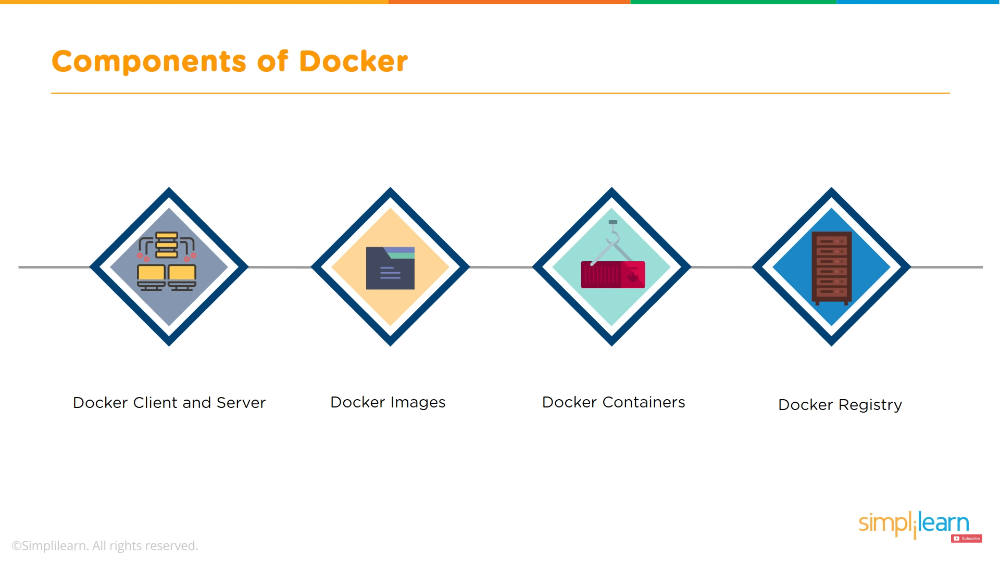
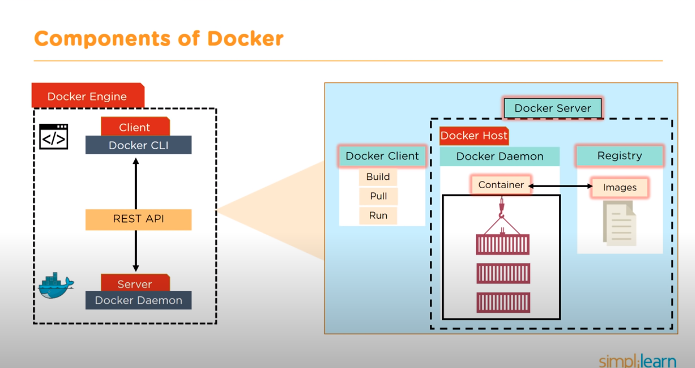
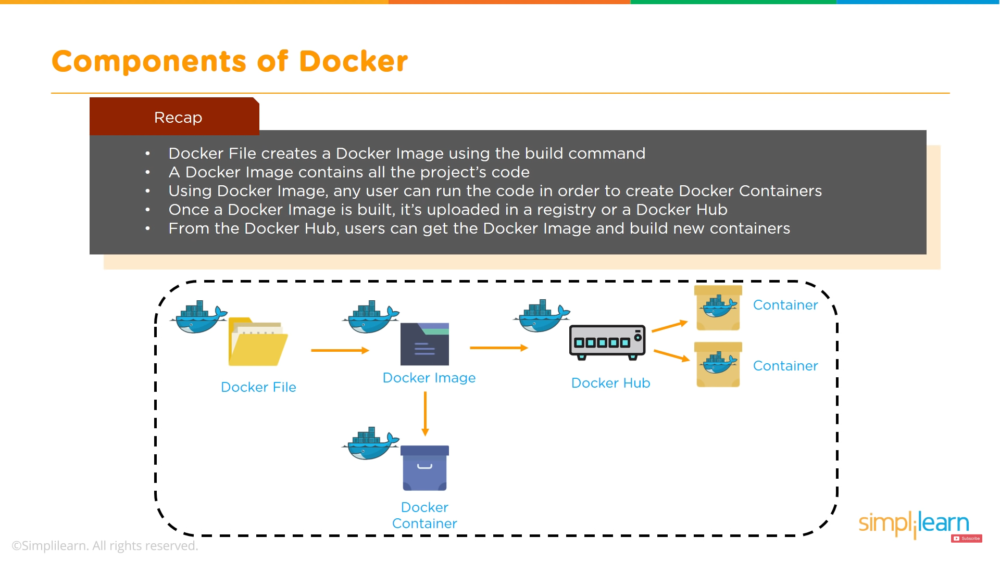

# A glimpse of Docker: [What is Docker and how does it work? - YouTube](https://youtu.be/rOTqprHv1YE?t=248)
Four components of Docker:
  - Docker Client and Server: client side control from terminal, run commands to interact with server (Docker Daemon and Registry)
  - Docker Images: instructions to create Docker Containers, stored in a Dockerfile
  - Docker Containers: a standalone, executable software package which includes applications and their dependencies
  - Docker Registry: server-side service to host and distribute images, images can be stored in either public or private repositories

Structure of Docker Engine:

Workflow of Docker:

# Install Docker on Linux
1. set up the Docker repository
2. remove old version of Docker installed on machine
3. download and install the Debian package

# Terminologies
[Docker Engine](https://docs.docker.com/engine/)
- Docker Engine is loosely the regular Docker for Linux. Docker Engine is an open source containerization technolog for building and containerizing applications. Docker Engine acts as a client-server application with:
  - a server with a long-running daemon process [dockerd](https://docs.docker.com/engine/reference/commandline/dockerd/)
  - APIs which specify interfaces that programs can use to talk and talk to and instruct the Docker daemon
  - a command line interface (CLI) client [docker](https://docs.docker.com/engine/reference/commandline/cli/)

[Docker Desktop](https://docs.docker.com/desktop/)
- Docker Desktop is loosely the Windows and MacOS version of Docker Engine. Docker Desktop includes Docker Engine, Docker CLI client, Docker Compose, Docker Content Trust, Kubernetes, and Credential Helper [].

[Containerd IO vs Docker CE vs Docker CE CLI - StackOverflow](https://stackoverflow.com/questions/58741267/containerd-io-vs-docker-ce-cli-vs-docker-ce-what-are-the-differences-and-what-d)
- Docker CE (docker-ce): Docker Engine Community Edition
- Docker CE CLI (docker-ce-cli): Command Line Interface for Docker CE 
- Daemon Containerd (containerd.io): 

# References
- [Docker Overview](https://docs.docker.com/get-started/overview/)
- [Docker Get Started](https://docs.docker.com/get-started/)
- [Docker Engine release notes](https://docs.docker.com/engine/release-notes/)
- [Install Docker Desktop on Mac](https://docs.docker.com/desktop/mac/install/)
- [Install Docker Desktop on Window](https://docs.docker.com/desktop/windows/install/)
- [Docker Desktop vs DIY with Docker Engine](https://www.docker.com/products/docker-desktop/alternatives/)
